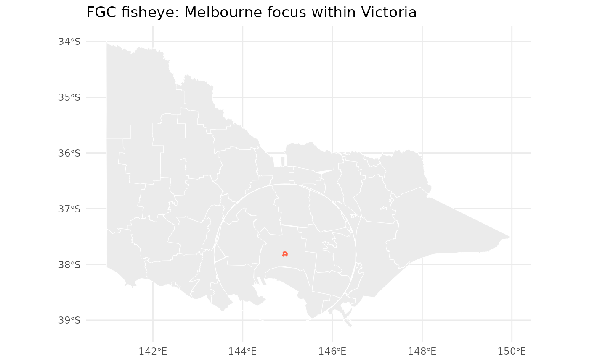
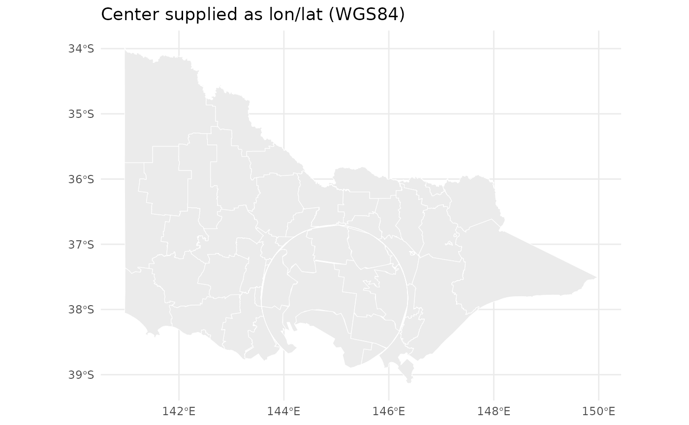
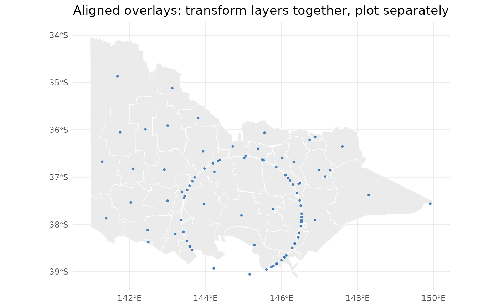
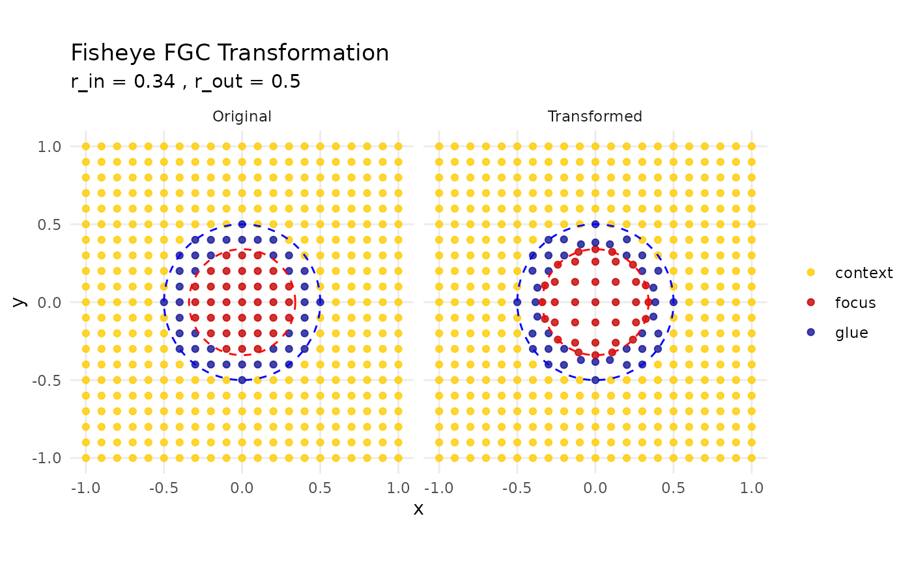

# Mapycus

tune parameters, and align
m`{r, include = FALSE} knitr::opts_chunk$set( collapse = TRUE, comment = "#>" )`
\## Overview

mapycusmaximus implements a projection-aware, vector-geometry fisheye
based on the Focus-Glue-Context (FGC) model. The transform magnifies a
chosen focus (inner radius `r_in`), transitions smoothly through a glue
ring (`r_out`), and preserves the outer context. It is provided at two
levels:

- [`fisheye_fgc()`](https://alex-nguyen-vn.github.io/mapycusmaximus/reference/fisheye_fgc.md)
  — numeric coordinates (matrix) with diagnostics
- [`sf_fisheye()`](https://alex-nguyen-vn.github.io/mapycusmaximus/reference/sf_fisheye.md)
  — `sf`/`sfc` objects with CRS handling and normalization

This vignette shows how to apply the fisheye to common `sf` layers,
ultiple layers for a single figure.

## Setup

``` r
library(sf)
```

    ## Linking to GEOS 3.12.1, GDAL 3.8.4, PROJ 9.4.0; sf_use_s2() is TRUE

``` r
library(ggplot2)
library(mapycusmaximus)
theme_set(ggplot2::theme_minimal())
```

The package ships example data:

- `vic`: Victoria LGA polygons (projected)
- `vic_fish`: fisheye-distorted `vic` (for reference examples)
- `conn_fish`: sample transfer lines (already warped in data
  preparation)

## Quick start: warp a polygon layer

[`sf_fisheye()`](https://alex-nguyen-vn.github.io/mapycusmaximus/reference/sf_fisheye.md)
chooses a sensible projected working CRS and normalizes coordinates
around a center. With `preserve_aspect = TRUE` (default), radii are
interpreted in unit-like space (≈ fraction of the layer’s half-span).

``` r
# Focus near a supplied geometry: use the centroid of the combined Melbourne polygon
melbourne <- vic[vic$LGA_NAME == "MELBOURNE", ]

vic_fisheye_demo <- sf_fisheye(
  vic,
  center = melbourne,      # accept sf/sfc; centroid is used in working CRS
  r_in = 0.34, r_out = 0.60,
  zoom_factor = 15,
  squeeze_factor = 0.35,
  method = "expand",
  revolution = 0
)

ggplot() +
  geom_sf(data = vic_fisheye_demo, fill = "grey92", color = "white", linewidth = 0.2) +
  geom_sf(data = melbourne, fill = NA, color = "tomato", linewidth = 0.5) +
  ggtitle("FGC fisheye: Melbourne focus within Victoria")
```



## Choosing a center

You may supply the focus center in several ways:

- As a geometry: `center = melbourne` (centroid of the combined
  geometry)
- As lon/lat: `center = c(144.9631, -37.8136)`,
  `center_crs = "EPSG:4326"`
- As map units (working CRS): `center = c(x, y)`
- As normalized coordinates in `[-1, 1]`: `normalized_center = TRUE`

``` r
# Example: WGS84 center (Melbourne CBD), auto-project to a working CRS
vic_cbd <- sf_fisheye(
  vic,
  center = c(144.9631, -37.8136),
  center_crs = "EPSG:4326",
  r_in = 0.30, r_out = 0.55,
  zoom_factor = 15, squeeze_factor = 0.30
)

ggplot(vic_cbd) +
  geom_sf(fill = "grey92", color = "white", linewidth = 0.2) +
  ggtitle("Center supplied as lon/lat (WGS84)")
```



## Aligning multiple layers

To keep overlays aligned, apply the exact same fisheye parameters to
each layer and ensure they share the same working CRS and normalization.
A robust pattern is to bind layers together, transform once, then split
for plotting; this guarantees a common bounding box for normalization.

``` r
centroids <- st_centroid(vic)
```

    ## Warning: st_centroid assumes attributes are constant over geometries

``` r
vic$layer <- "polygon"
centroids$layer <- "centroid"
both <- rbind(vic[, c("LGA_NAME", "geometry", "layer")],
              centroids[, c("LGA_NAME", "geometry", "layer")])

both_fish <- sf_fisheye(both, center = melbourne,
                        r_in = 0.34, r_out = 0.60,
                        zoom_factor = 15, squeeze_factor = 0.35)

ggplot() +
  geom_sf(data = both_fish[both_fish$layer == "polygon", ],
          fill = "grey92", color = "white", linewidth = 0.2) +
  geom_sf(data = both_fish[both_fish$layer == "centroid", ],
          color = "#2b6cb0", size = 0.6, alpha = 0.8) +
  ggtitle("Aligned overlays: transform layers together, plot separately")
```



If layers must be transformed separately, current per-layer
normalization can lead to slight radius mismatches. A practical
workaround is to compute a scale factor from a reference layer’s bbox
and multiply `r_in`/`r_out` accordingly, e.g.:

``` r
all_points <- sf_fisheye(all_points, center = melbourne,
                         zoom_factor = 1.8, squeeze_factor = 0.30)
scale_radii <- 1 - (((st_bbox(vic)["xmax"] - st_bbox(vic)["xmin"])  -
                     (st_bbox(all_points)["xmax"] - st_bbox(all_points)["xmin"])) /
                    (st_bbox(vic)["xmax"] - st_bbox(vic)["xmin"]))
vic_fisheye <- sf_fisheye(vic, center = melbourne,
                          r_in = 0.35 * scale_radii,
                          r_out = 0.50 * scale_radii,
                          zoom_factor = 1.8, squeeze_factor = 0.30)
```

Future versions will expose a parameter object or `match_to` argument so
multiple layers can share normalization and radii without manual
scaling.

## Diagnostics with numeric coordinates

Use
[`create_test_grid()`](https://alex-nguyen-vn.github.io/mapycusmaximus/reference/create_test_grid.md)
and
[`plot_fisheye_fgc()`](https://alex-nguyen-vn.github.io/mapycusmaximus/reference/plot_fisheye_fgc.md)
to understand the mapping in isolation from GIS workflows.

``` r
grid <- create_test_grid(range = c(-1, 1), spacing = 0.1)
warp <- fisheye_fgc(grid, r_in = 0.34, r_out = 0.5,
                    zoom_factor = 1.3, squeeze_factor = 0.5)
plot_fisheye_fgc(grid, warp, r_in = 0.34, r_out = 0.5)
```



## CRS and reproducibility tips

- Let
  [`sf_fisheye()`](https://alex-nguyen-vn.github.io/mapycusmaximus/reference/sf_fisheye.md)
  auto-select a working CRS for lon/lat inputs, or set `target_crs`
  explicitly for project standards.
- Prefer `center` as an `sf`/`sfc` geometry or as lon/lat with
  `center_crs` for clarity.
- Use `normalized_center = TRUE` and fixed radii for small multiples
  across regions.

## Caveats

The fisheye intentionally distorts distances and areas within the focus
and glue zones. Use it for visual exploration and communication; run
quantitative spatial analysis on the original geometry. For publication
figures, set `revolution = 0` and describe the distortion in the
caption.
