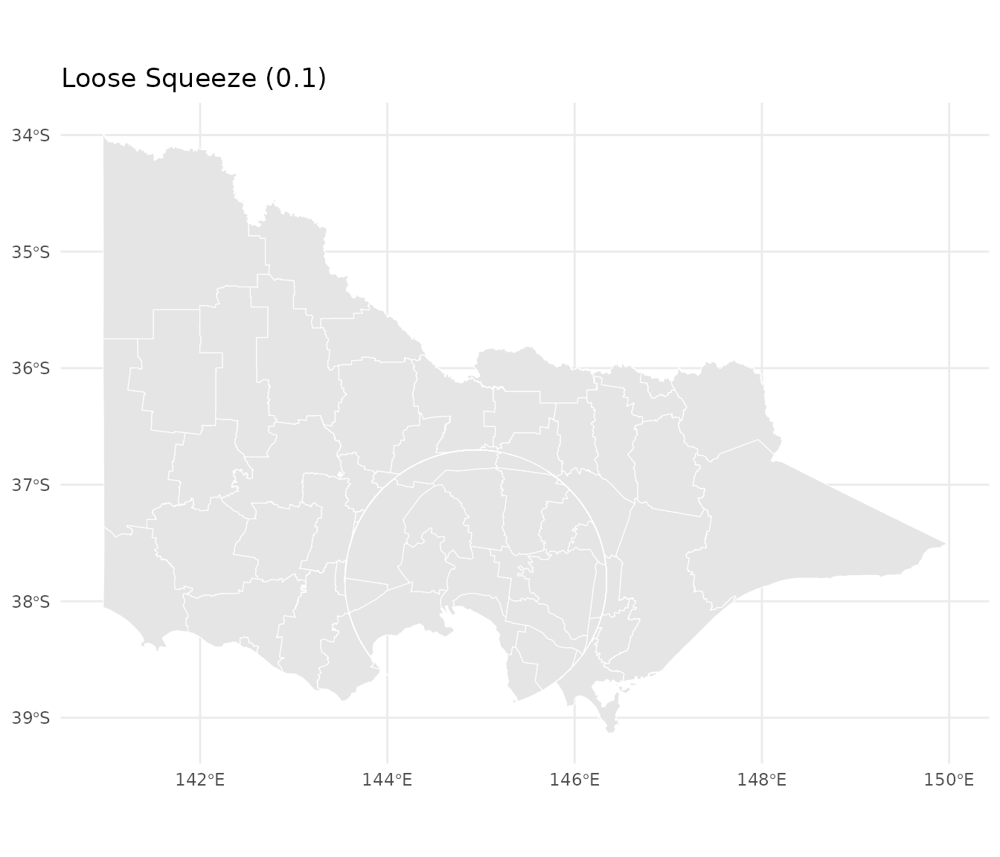
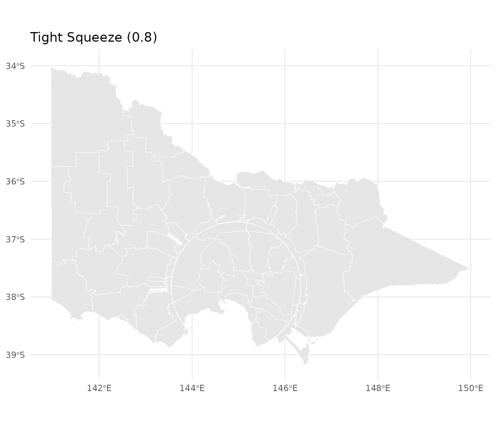

# Getting Started with mapycusmaximus

## Introduction

**mapycusmaximus** brings fisheye transformations to R’s spatial
ecosystem. Just as `ggplot2` transforms how we visualize data and
`dplyr` transforms how we manipulate it, mapycusmaximus transforms how
we view geographic space—allowing you to magnify local detail while
preserving regional context.

The package implements the **Focus-Glue-Context (FGC)** model, a
three-zone radial transformation that:

- **Magnifies** features in the focus region (like zooming in)
- **Smoothly transitions** through the glue zone (preventing jarring
  distortions)
- **Preserves** the outer context (maintaining geographic orientation)

This vignette will show you how to use mapycusmaximus with real spatial
data, following tidyverse principles of working with data.

``` r
library(mapycusmaximus)
library(sf)
library(ggplot2)

# Use a minimal theme for clean visualizations
theme_set(theme_minimal())
```

## Your First Fisheye

Let’s start with the built-in Victoria LGA dataset. The goal is to
magnify Melbourne while keeping the rest of Victoria visible.

``` r
# Examine the data
data(vic)
vic
#> Simple feature collection with 79 features and 1 field
#> Geometry type: MULTIPOLYGON
#> Dimension:     XY
#> Bounding box:  xmin: 140.9619 ymin: -39.13442 xmax: 149.9762 ymax: -33.98064
#> Geodetic CRS:  WGS 84
#> First 10 features:
#>      LGA_NAME                       geometry
#> 1      ALPINE MULTIPOLYGON (((146.7238 -3...
#> 2      ARARAT MULTIPOLYGON (((143.0904 -3...
#> 3    BALLARAT MULTIPOLYGON (((143.9239 -3...
#> 4     BANYULE MULTIPOLYGON (((145.1342 -3...
#> 5  BASS COAST MULTIPOLYGON (((145.3214 -3...
#> 6     BAW BAW MULTIPOLYGON (((145.7643 -3...
#> 7     BAYSIDE MULTIPOLYGON (((144.986 -37...
#> 8     BENALLA MULTIPOLYGON (((146.1131 -3...
#> 9  BOROONDARA MULTIPOLYGON (((145.1039 -3...
#> 10   BRIMBANK MULTIPOLYGON (((144.8829 -3...
```

The simplest fisheye uses defaults and automatically determines the
center:

``` r
# Apply fisheye transformation
vic_warped <- fisheye_fgc(
  vic,
  r_in = 0.3,        # Focus radius
  r_out = 0.6,       # Glue boundary
  zoom_factor = 2,   # Magnification strength
  squeeze_factor = 0.35
)

# Visualize with ggplot2
ggplot(vic_warped) +
  geom_sf(fill = "grey90", color = "white", linewidth = 0.3) +
  labs(title = "Victoria LGAs with Default Fisheye")
```


A basic fisheye transformation of Victoria’s LGAs

That’s it! But to really control the transformation, you’ll want to
specify a focus point.

## Specifying the Focus Point

The fisheye center determines what gets magnified. There are several
ways to specify it:

### Using a Geometry

The most natural approach—pass an `sf` object and mapycusmaximus uses
its centroid:

``` r
# Extract Melbourne CBD as the focus
melbourne <- vic[vic$LGA_NAME == "MELBOURNE", ]

vic_melbourne <- fisheye_fgc(
  vic,
  center = melbourne,      # Centroid becomes the warp center
  r_in = 0.34,
  r_out = 0.60,
  zoom_factor = 15,
  squeeze_factor = 0.35
)

ggplot() +
  geom_sf(data = vic_melbourne, fill = "grey92", color = "white", linewidth = 0.2) +
  geom_sf(data = melbourne, fill = NA, color = "tomato", linewidth = 0.8) +
  labs(title = "Melbourne CBD Magnified",
       subtitle = "Focus defined by Melbourne LGA geometry")
```


Fisheye centered on Melbourne CBD

### Using Longitude/Latitude

Specify coordinates directly in WGS84:

``` r
# Melbourne CBD coordinates (WGS84)
melb_coords <- c(144.9631, -37.8136)

vic_coords <- fisheye_fgc(
  vic,
  center = melb_coords,
  center_crs = "EPSG:4326",   # Explicitly state CRS
  r_in = 0.30,
  r_out = 0.55,
  zoom_factor = 12,
  squeeze_factor = 0.30
)

ggplot(vic_coords) +
  geom_sf(fill = "grey92", color = "white", linewidth = 0.2) +
  labs(title = "Center Specified as Lon/Lat",
       subtitle = "Coordinates: 144.96°E, 37.81°S")
```


Fisheye using lon/lat coordinates

### Using Projected Coordinates

If you’re already working in a projected CRS, pass coordinates directly:

``` r
# Example: coordinates in the working CRS (meters)
vic_projected <- fisheye_fgc(
  vic,
  cx = 321000,      # Easting (meters)
  cy = 5813000,     # Northing (meters)
  r_in = 0.3,
  r_out = 0.6,
  zoom_factor = 10,
  squeeze_factor = 0.35
)
```

## Understanding Parameters

The transformation is controlled by four key parameters:

### Focus and Glue Radii

`r_in` and `r_out` define the transformation zones in **normalized
space** (roughly -1 to 1):

``` r
# Small focus, narrow glue
vic_tight <- fisheye_fgc(vic, center = melbourne, r_in = 0.2, r_out = 0.3, 
                        zoom_factor = 8, squeeze_factor = 0.35)

# Large focus, wide glue
vic_wide <- fisheye_fgc(vic, center = melbourne, r_in = 0.4, r_out = 0.7, 
                       zoom_factor = 8, squeeze_factor = 0.35)

p1 <- ggplot(vic_tight) + 
  geom_sf(fill = "grey90", color = "white", linewidth = 0.2) +
  labs(title = "Tight Focus (r_in=0.2, r_out=0.3)")

p2 <- ggplot(vic_wide) + 
  geom_sf(fill = "grey90", color = "white", linewidth = 0.2) +
  labs(title = "Wide Focus (r_in=0.4, r_out=0.7)")

# Display side by side (requires patchwork or cowplot)
# p1 + p2
p1
```


Effect of different radius settings

``` r
p2
```


Effect of different radius settings

### Zoom Factor

Controls magnification strength inside the focus:

``` r
# Gentle zoom
vic_gentle <- fisheye_fgc(vic, center = melbourne, r_in = 0.3, r_out = 0.5, 
                         zoom_factor = 3, squeeze_factor = 0.35)

# Aggressive zoom
vic_aggressive <- fisheye_fgc(vic, center = melbourne, r_in = 0.3, r_out = 0.5, 
                             zoom_factor = 20, squeeze_factor = 0.35)

ggplot(vic_gentle) + 
  geom_sf(fill = "grey90", color = "white", linewidth = 0.2) +
  labs(title = "Gentle Magnification (zoom = 3)")
```


Effect of zoom factor

``` r

ggplot(vic_aggressive) + 
  geom_sf(fill = "grey90", color = "white", linewidth = 0.2) +
  labs(title = "Strong Magnification (zoom = 20)")
```


Effect of zoom factor

### Squeeze Factor

Controls compression in the glue zone (0 to 1):

``` r
# Minimal squeeze (wider glue transition)
vic_loose <- fisheye_fgc(vic, center = melbourne, r_in = 0.3, r_out = 0.5, 
                        zoom_factor = 8, squeeze_factor = 0.1)

# Strong squeeze (narrow glue transition)
vic_tight_squeeze <- fisheye_fgc(vic, center = melbourne, r_in = 0.3, r_out = 0.5, 
                                zoom_factor = 8, squeeze_factor = 0.8)

ggplot(vic_loose) + 
  geom_sf(fill = "grey90", color = "white", linewidth = 0.2) +
  labs(title = "Loose Squeeze (0.1)")
```



``` r

ggplot(vic_tight_squeeze) + 
  geom_sf(fill = "grey90", color = "white", linewidth = 0.2) +
  labs(title = "Tight Squeeze (0.8)")
```



## Working with Multiple Layers

When you have multiple layers (points, lines, polygons), transform them
together to ensure alignment:

``` r
# Create centroids as a point layer
centroids <- st_centroid(vic)

# Add a layer identifier to each
vic_layer <- vic |> 
  dplyr::mutate(layer = "polygon")

centroids_layer <- centroids |> 
  dplyr::mutate(layer = "centroid")

# Combine layers before transformation
both_layers <- rbind(
  vic_layer[, c("LGA_NAME", "geometry", "layer")],
  centroids_layer[, c("LGA_NAME", "geometry", "layer")]
)

# Apply fisheye once to combined data
both_warped <- fisheye_fgc(
  both_layers,
  center = melbourne,
  r_in = 0.34,
  r_out = 0.60,
  zoom_factor = 12,
  squeeze_factor = 0.35
)

# Separate for plotting
polygons_warped <- both_warped[both_warped$layer == "polygon", ]
points_warped <- both_warped[both_warped$layer == "centroid", ]

# Plot together
ggplot() +
  geom_sf(data = polygons_warped, fill = "grey92", color = "white", 
          linewidth = 0.2) +
  geom_sf(data = points_warped, color = "#2b6cb0", size = 1.2, alpha = 0.7) +
  labs(title = "Aligned Layers: Polygons and Centroids",
       subtitle = "Transformed together to ensure perfect alignment")
```


Multiple aligned layers with fisheye transformation

**Why combine first?** When layers are transformed separately, they may
have different bounding boxes, leading to slightly different normalized
coordinates and misalignment.

## Projection Handling

mapycusmaximus is projection-aware and handles CRS transformations
automatically:

### Geographic to Projected

If your data is in longitude/latitude, the package automatically selects
an appropriate projected CRS:

``` r
# Create data in WGS84
vic_lonlat <- st_transform(vic, "EPSG:4326")
st_crs(vic_lonlat)$proj4string
#> [1] "+proj=longlat +datum=WGS84 +no_defs"

# Apply fisheye - auto-projects to GDA2020/MGA55 for Victoria
vic_auto <- fisheye_fgc(
  vic_lonlat,
  center = melbourne,
  r_in = 0.3,
  r_out = 0.5,
  zoom_factor = 10,
  squeeze_factor = 0.35
)

# Original CRS is restored
st_crs(vic_auto)$proj4string
#> [1] "+proj=longlat +datum=WGS84 +no_defs"
```

The package uses sensible defaults: - Victoria region → **EPSG:7855**
(GDA2020 / MGA Zone 55) - Other areas → **UTM** zones based on centroid

### Custom Projection

Override the automatic selection with `target_crs`:

``` r
vic_custom <- fisheye_fgc(
  vic_lonlat,
  center = melbourne,
  target_crs = "EPSG:3111",  # VicGrid
  r_in = 0.3,
  r_out = 0.5,
  zoom_factor = 10,
  squeeze_factor = 0.35
)
```

## Advanced: Grid Diagnostics

For understanding the transformation itself, use the low-level
[`fisheye_fgc()`](https://alex-nguyen-vn.github.io/mapycusmaximus/reference/fisheye_fgc.md)
function with test grids:

``` r
# Create a regular grid
grid <- create_test_grid(range = c(-1, 1), spacing = 0.1)

# Apply transformation
warped <- fisheye_fgc(
  grid,
  r_in = 0.34,
  r_out = 0.5,
  zoom_factor = 1.3,
  squeeze_factor = 0.5
)

# Visualize the transformation
plot_fisheye_fgc(grid, warped, r_in = 0.34, r_out = 0.5)
```


Understanding the FGC transformation with a test grid

The visualization shows: - **Red zone**: Focus (magnified) - **Blue
zone**: Glue (transitional compression) - **Yellow zone**: Context
(unchanged)

## Real-World Example: Metropolitan Focus

Here’s a complete workflow showing how to emphasize a metro area while
maintaining state context:

``` r
# 1. Define the metropolitan region
metro_lgas <- c("MELBOURNE", "PORT PHILLIP", "STONNINGTON", "YARRA", 
                "MARIBYRNONG", "MOONEE VALLEY", "BOROONDARA", 
                "GLEN EIRA", "BAYSIDE")

metro_region <- vic[vic$LGA_NAME %in% metro_lgas, ]
metro_center <- st_union(metro_region) |> st_centroid()

# 2. Add a population indicator (example)
vic_pop <- vic |> 
  dplyr::mutate(is_metro = LGA_NAME %in% metro_lgas)

# 3. Apply fisheye
vic_focused <- fisheye_fgc(
  vic_pop,
  center = metro_center,
  r_in = 0.25,
  r_out = 0.40,
  zoom_factor = 12,
  squeeze_factor = 0.35
)

# 4. Create publication-ready plot
ggplot(vic_focused) +
  geom_sf(aes(fill = is_metro), color = "white", linewidth = 0.2) +
  scale_fill_manual(
    values = c("TRUE" = "#d95f02", "FALSE" = "grey85"),
    labels = c("Metropolitan", "Regional"),
    name = NULL
  ) +
  theme_minimal() +
  theme(
    legend.position = c(0.85, 0.15),
    legend.background = element_rect(fill = "white", color = "grey70"),
    panel.grid = element_blank()
  ) +
  labs(
    title = "Metropolitan Melbourne with Regional Context",
    subtitle = "Fisheye magnification preserves spatial relationships",
    caption = "Transformation: r_in = 0.25, r_out = 0.40, zoom = 12"
  )
```


Complete workflow: Metropolitan Melbourne in Victorian context

## Best Practices

### Parameter Selection

Start conservative and iterate:

``` r
# Start here
fisheye_fgc(data, r_in = 0.3, r_out = 0.5, zoom_factor = 5, squeeze_factor = 0.35)

# Too distorted? Reduce zoom or widen glue
fisheye_fgc(data, r_in = 0.3, r_out = 0.6, zoom_factor = 3, squeeze_factor = 0.35)

# Need more magnification? Increase zoom gradually
fisheye_fgc(data, r_in = 0.3, r_out = 0.5, zoom_factor = 10, squeeze_factor = 0.35)
```

### Layer Alignment

Always combine layers before transformation:

``` r
# Good: Single transformation
combined <- rbind(layer1, layer2, layer3)
warped <- fisheye_fgc(combined, ...)

# Avoid: Separate transformations
layer1_warped <- fisheye_fgc(layer1, ...)  # Different normalization
layer2_warped <- fisheye_fgc(layer2, ...)  # May not align perfectly
```

### Reproducibility

Be explicit about parameters for reproducible analyses:

``` r
# Explicit and reproducible
result <- fisheye_fgc(
  data,
  center = st_point(c(144.9631, -37.8136)),
  center_crs = "EPSG:4326",
  target_crs = "EPSG:7855",
  r_in = 0.34,
  r_out = 0.60,
  zoom_factor = 12,
  squeeze_factor = 0.35,
  preserve_aspect = TRUE,
  revolution = 0
)
```

## Performance Tips

For large datasets:

1.  **Simplify geometries** before transformation if appropriate
2.  **Remove empty geometries** (done automatically, but pre-filtering
    helps)
3.  **Transform once**, not repeatedly in a loop

``` r
# Pre-process large data
data_clean <- data |>
  filter(!st_is_empty(geometry)) |>
  st_simplify(dTolerance = 100)  # Adjust tolerance as needed

# Transform once
data_warped <- fisheye_fgc(data_clean, ...)
```

## Common Issues

### Layers Don’t Align

**Problem**: Points and polygons don’t line up after transformation.

**Solution**: Transform together (see “Working with Multiple Layers”).

### Excessive Distortion

**Problem**: Features look overly warped.

**Solution**: Reduce `zoom_factor` or increase `r_out` to widen the glue
zone.

### Features Overlap in Focus

**Problem**: Too much magnification causes overlap.

**Solution**: This is expected behavior. Reduce `zoom_factor` if
problematic.

## Next Steps

- **Advanced transformations**: Explore the `revolution` parameter for
  rotational effects
- **Interactive visualization**: Use
  [`shiny_fisheye()`](https://alex-nguyen-vn.github.io/mapycusmaximus/reference/shiny_fisheye.md)
  for interactive parameter tuning
- **Custom workflows**: Combine with other sf operations in analysis
  pipelines

## Getting Help

- Package documentation:
  [`?fisheye_fgc`](https://alex-nguyen-vn.github.io/mapycusmaximus/reference/fisheye_fgc.md)
- GitHub issues: \[Report bugs or request features\]
- Examples: See
  [`?vic`](https://alex-nguyen-vn.github.io/mapycusmaximus/reference/vic.md)
  for built-in datasets

## References

The Focus-Glue-Context model is based on:

- Yamamoto, D., et al. (2009). “A Focus+Glue+Context Information
  Visualization Technique for Web Map Services”
- Furnas, G. W. (1986). “Generalized fisheye views”

------------------------------------------------------------------------

**Remember**: Fisheye transformations distort distances and areas. Use
them for visualization and exploration, but perform quantitative
analyses on the original geometries.
